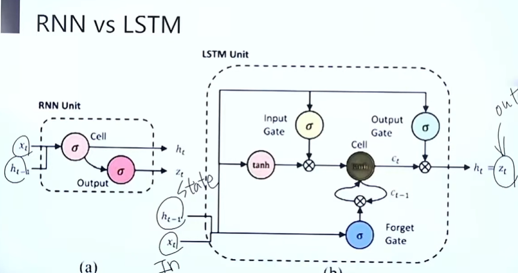

# LSTM (Long Short-Term Memory)

> 📺 유튜브 강의를 보며 정리 · [← 개념 목록](README.md) · 이전 : [Vanishing Gradient](vanishing-gradient.md)

## LSTM
- gradient flow를 제어할 수 있는 밸브 역할
- 4개의 MLP 구조 : state-space의 입력, 상태, 출력 + **gate** 구조

## LSTM vs RNN

- 4개의 gate
  - input gate
  - forget gate
  - cell
  - output gate

## 4개의 Gate?
- step1 : forget gate
  - x2 ← x1, u2 조합
  - 이 이전 상태와 입력을 얼마나 사용(잊어버릴것)할 것인지 결정하는 게이트
- step2 : input gate
  - 이전상태와 입력을 얼마나 활용할 것인지 결정하는 게이트
- step3 : cell
  - step1, step2에서 나온 데이터 섞기
- step4 : output gate
  - 위 정보들을 모두 종합해서 다음 상태 결정

---
관련 : [GRU](gru.md) (간단한 버전) · [BiLSTM](bilstm.md) (양방향 확장)
