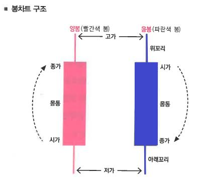
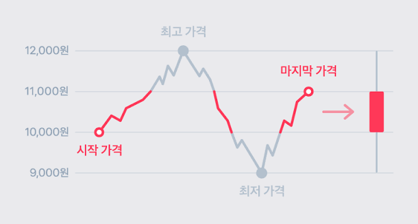

# OHLCV

> [← 개념 목록](README.md)

- Open 시가
  - 시작가격
- High 고가
  - 최고 가격
- Low 저가
  - 최저 가격
- Close 종가
  - 마지막 가격
- Volume 거래량
  - 거래된 량

## 이동평균선
- 영업일 기준 5, 20, 60일 단위로 평균값 계산한것을 선으로 이어놓음
- 주식이 평균적으로 어떻게 이동중인가 확인

---

## 👉 코드로 확인

- [data_load_krx.ipynb](../03_practice/data_load_krx.ipynb) — 삼성전자 1년치 일봉 (시가·고가·저가·종가·거래량·등락률)
