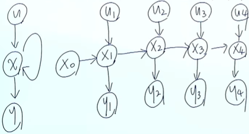
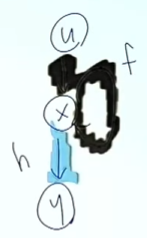
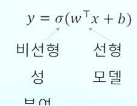
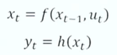
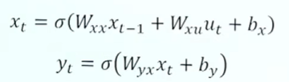
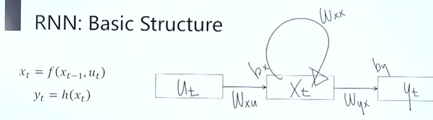
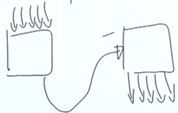

# RNN (Recurrent Neural Network)

> 📺 유튜브 강의를 보며 정리 · 2026-09 · [← 개념 목록](README.md)

- 시계열 데이터 처리하기 좋은 뉴럴 네트워크 구조
  - 사용처 : 음성인식, dna 염기서열 분석, 감정 분석, 번역기 등

## CNN vs RNN
- CNN : 이미지 구역별로 같은 weight 공유
- RNN : 시간별로 같은 weight 공유 (현재와 과거는 같은 weight 공유)

## First Order System
- 현재 시간의 상태 ← 이전 시간 상태 관련
- **autonomous system : 이 시스템은 외부입력 없이 자기 혼자서 돌아감 (셀프 피드백)**
  - Xt = f(Xt-1)
- 현재 입력도 존재하는 경우 ? (이전시간 상태 + 현재 입력)
  - Xt = f(Xt-1, Ut)

## State-Space Model

- 어떤 시스템을 해석하기 위한 3요소 : 입력, 상태, 출력
  - Xt(상태) = f(Xt-1(상태), Ut(입력)) → 1차원 시스템 모형, 이때 Xt 관측 가능?
    - Xt는 온도, 기후, 등등 이런게 될 수 있고 이 모든걸 다 관측하기는 어려움.
    - but 각 시간에서 관측 가능한 상태 모음 = 출력 Yt
    - 이때 Xt는 스스로 피드백하여도 동작함
    - 상태 Xt 의미 ? hidden layer의 state. 이전까지의 상태들과 이전까지의 입력을 대표할 수 있는 압축본. 즉 Xt는 시계열로 들어오는 입력들을 최대한 상세히 표현가능해야 함.
      - X4 ← X0~3 && U1~4
  - Yt(출력) = h(Xt) (h라는 비선형 함수)

## State-Space Model as RNN

### First-order Markov Model
- 원래 풀고 싶었던 문제 : Xt = f(Ut, Ut-1, Ut-2, .., U0)
  - 입력값들 -직빵→ Xt : 사실상 힘듦
- 대신해서 풀 문제 : Xt = f(Xt-1, Ut)
  - Xt-1은 이전 상태들의 압축한 어떠한 "상태"

### State-Space Model 에서 근사하는 함수 : 2개 (f, h)

- Xt = f(Xt-1, Ut) (검은색 부분)
- Yt = h(Xt) (파란색 부분)
- 이 두 f, h 함수를 근사하기 위해 뉴럴 네트워크 사용 (각각 한개 해서 총 2개 뉴럴네트워크)

### 뉴럴 네트워크에서 State-Space Model ?
- (참고) 뉴럴 네트워크에서 비선형 함수 표현

  

  - Activation Function : 비선형성 부여
  - w : weight
  - b : bias
- 뉴럴 네트워크 셋팅으로 state-space model 근사 함수

  
  →
  

  - 총 5개 parameter matrix

### RNN 기본 구조

## RNN 훈련 방식
- ANN, CNN 처럼 back-propagation 이용
- BPTT : Back-propagation through time (시간에 따른 bp)

## RNN 문제 type
- many-to-many : input, output 여러개
  - back-propagation 할때 각각 봄
  - 번역시 사용
  - RNN에서 많이 사용하진 않음
- **many-to-one** ⭐ 주가 예측 논문들이 쓰는 구조 (과거 N일 → 다음 날 1개)
  - back-propagation 할때 마지막만 봄
  - 시계열 예측시에 사용
- one-to-many
  - 생성시 많이 사용 (문장 생성)
- sequence-to-sequence (seq2seq) = many-to-one + one-to-many

  

---
**다음 →** 기울기 소실(vanishing gradient) → LSTM
