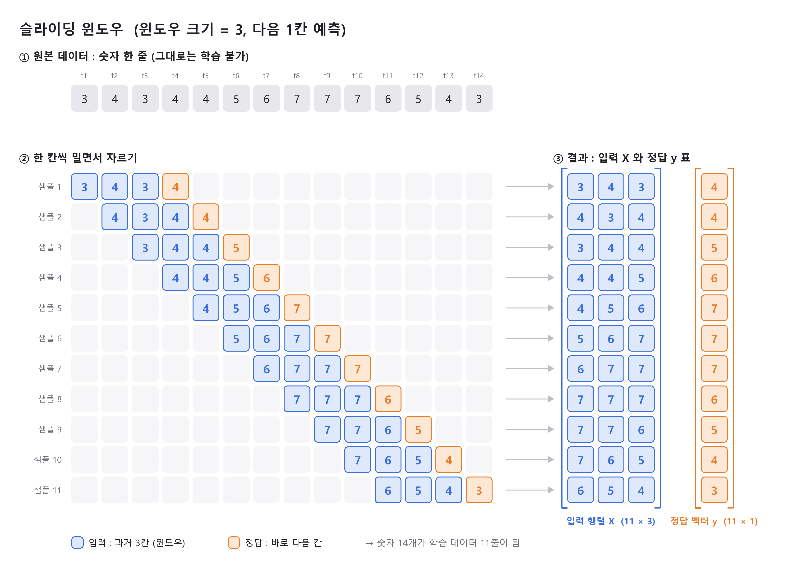
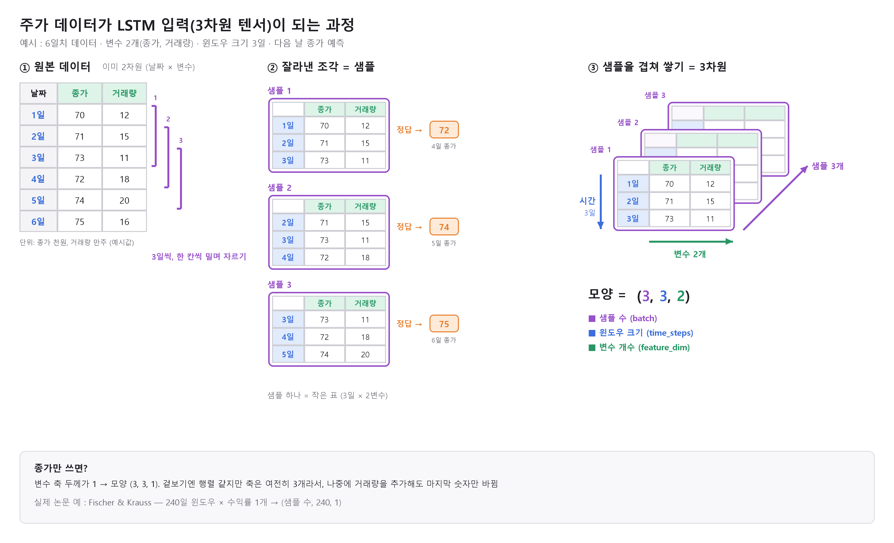

# Sliding Window (슬라이딩 윈도우)

> [← 개념 목록](README.md) · 관련 : [스칼라 / 벡터 / 행렬 / 텐서](tensor.md)

- 시계열 데이터를 한 칸씩 밀며 잘라 모델이 학습가능한 (입력 X, 정답 y) 표 데이터셋으로 만드는 전처리 기법
  - 이미지 라벨링처럼 입력-정답 쌍 만드는 거. 단, 정답이 데이터 안에 이미 있음 (다음 칸 값)
  - 결과 : 입력 X = 행렬/텐서, 정답 y = 벡터
- 고려할 점
  - 데이터 간격 : 한 칸이 얼마나의 시간인지 (1일/1달/5분 등)
    - 주식 예) 일봉(1일), 분봉(5분), 주봉(1주), 월봉(1달)
    - 대부분 논문은 일봉 사용 (Jiang : 일일 예측 > 장중 예측, 장중 데이터는 구하기 어려움)
  - 윈도우 크기 : 한번에 입력할 과거 데이터 길이
    - 주식 예) 일봉 + 윈도우 30 = 과거 30일(약 한 달) 보고 예측
    - Fischer : 240일 (약 1년치 거래일), Lu : 10일
    - 짧으면 정보 부족, 길면 옛날 패턴 섞이고 샘플 수 줄어듦
  - 스텝 사이즈 : 윈도우를 몇칸씩 옮길지에 대한 간격
    - 주식 예) 스텝 1 = 하루씩 밀며 매일 하나씩 샘플 생성
    - 스텝 5 = 일주일(거래일 5일)씩 건너뛰며 생성 → 샘플 수 1/5로 줄어듦
  - 예측 거리 : 몇 칸 뒤의 미래를 예측할지
    - 주식 예) 1칸 뒤 = 내일 종가, 5칸 뒤 = 일주일 뒤 종가
    - 멀리 맞힐수록 어려움
  - 변수 개수 : 한 시점에 넣는 변수
    - 주식예측문제 경우 종가/거래량/시가/고가 등의 변수들 존재. 학습에 있어 어느 변수까지 볼지에 대한 내용
    - 주식 예) 종가만 = 1, 종가+거래량 = 2, OHLCV = 5, OHLCV+이동평균+RSI = 7
    - Fischer : 수익률 1개 (단변량)
    - 변수 늘리기 = Jiang 향후 연구 방향의 "다중 데이터 소스"
- 시계열에서 데이터 학습 셋 만드는 방식

  
