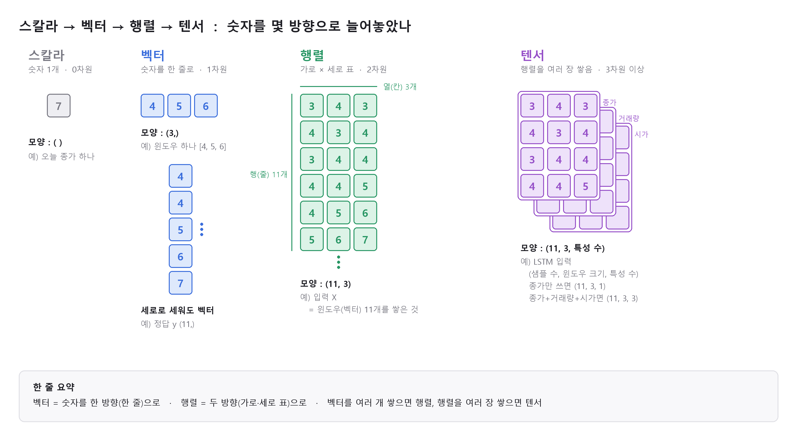

# 스칼라 / 벡터 / 행렬 / 텐서

> [← 개념 목록](README.md) · 관련 : [슬라이딩 윈도우](sliding-window.md)

| | 모양 | 늘어놓은 방향 | 우리 예시 |
|---|---|---|---|
| **스칼라** | `( )` | 없음 (숫자 1개) | 오늘 종가 7 |
| **벡터** | `(3,)` | **한 방향** (한 줄) | 윈도우 하나 [4, 5, 6], 정답 y |
| **행렬** | `(11, 3)` | **두 방향** (가로 × 세로) | 입력 X |
| **텐서** | `(11, 3, 1)` | **세 방향 이상** | LSTM에 실제로 넣는 입력 |
